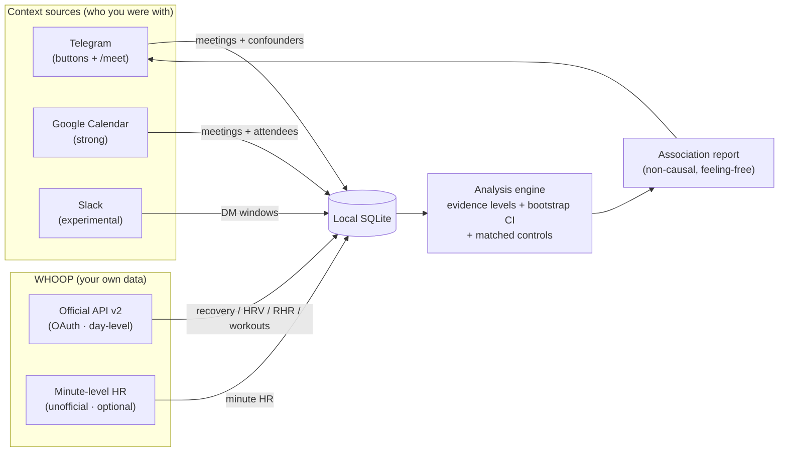

<p align="center">
  
</p>

<p align="center">
  
  
  
  
</p>

<p align="center">

[](https://github.com/archixusa/who-stresses-me-out/actions/workflows/ci.yml)

</p>

<p align="center">
  <b>People and contexts associated with physiological signals.</b><br>
  A private, self-hosted analytics tool that lines up <i>who you were with</i> against your own
  <b>WHOOP</b> heart-rate data and surfaces the contexts associated with a higher or lower
  heart-rate response.
</p>

> **Not causal. Not medical. No mood data collected.** This is a personal analytics tool, not a
> clinical, psychological, or medical assessment. It reports *associations* between contexts and a
> heart-rate signal — never that a person or situation *causes* stress — and it never asks how you
> feel.

---

## 💡 What it is (and what it deliberately is not)

WHOOP measures your body's heart rate, strain, and recovery, but it can't tell you which parts of
your day line up with an elevated signal. This project adds that context: you record the social
setting (**who** you were with and in **what context** — e.g. `Sam · work` vs `Sam · ex`), and the
analysis engine correlates those windows with your own heart-rate data.

The output is an **association report**, not a verdict:

> *"Which contexts are associated with a higher heart-rate response, and how strong is the evidence?"*

Three things make this a **privacy-first, non-causal** tool by design:

| Principle | How it shows up |
| --- | --- |
| **No mood input, ever** | The app collects **no** feeling / tension / survey / emotion input of any kind. There is no "rate how you felt" screen anywhere. This is a feature, not an omission. |
| **Associations, not causes** | Reports say *"associated with a higher heart-rate response"* — never *"X stresses you out"*. Every ranking carries an **evidence level** and, where possible, an uncertainty interval. |
| **Your data only** | Participants are **never** contacted or messaged. The tool reads only **your own** WHOOP account and stores everything in a **local SQLite** file on your machine. |

> 🔐 **Aliases encouraged.** Use `Alex`, `Sam`, `Jordan` (or `coach`, `ex`, `landlord`) instead of
> real names. The analysis works identically on aliases, and your export stays readable only to you.

## 📟 A sample report

This is the real output shape produced by [`report.py`](report.py) — placeholder names only:

```text
📊 Association report (last 7 days)

  Heart-rate data through 12 Jul 08:15 (9/11 logged events matched).
  Official WHOOP context: 9 days.

👤 Person · context — higher heart-rate association
  • Sam · work: mean +8.4 BPM (median +7.9) [95% CI 2.1…14.6] · 6 events · emerging signal
  • Alex · ex: mean +6.2 BPM (median +5.1) [95% CI 1.4…11.0] · 4 events · emerging signal · group context — limited per-person attribution
  • Jordan · daily: mean +3.0 BPM (median +2.4) [95% CI -1.8…7.9] · 3 events · weak signal

🌿 Contexts associated with a lower heart-rate response
  • Jordan · family: mean -4.1 BPM (median -3.8) [95% CI -7.9…-0.6] · 5 events · consistent signal

⏳ Needs more data (2): Alex · daily, Sam · casual

🌙 Day-level (official WHOOP, 9 days)
  Personal avg recovery 63% · HRV 74ms · RHR 58
  Next-morning recovery after seeing them (drop = worse recovery):
  • Sam · work: recovery -11.8 pts (51.2%), strain 14.2, sleep 76% · 5d · emerging signal

🔎 Data quality
  • 1 context(s) include events flagged with caffeine/alcohol/illness/commute — their evidence is downweighted.
  • 2 context(s) have low heart-rate coverage.

🧪 Small experiments for this week
  • Log "Alex · daily" 2–3 more times to reach a usable sample.
  • Try a 10-minute calm buffer before "Sam · work" and compare later events.
  • Note in a word what makes "Jordan · family" feel easier, for later comparison.

These are associations, not causes — sleep, activity, caffeine and time of day all affect heart
rate. Not a medical or psychological assessment. Times shown in Europe/Istanbul.
```

Notice what is **not** there: no "stress score", no "how did you feel", no ranking of people as
stressful. Just contexts, an effect size in BPM, a confidence interval, an evidence label, and
honest caveats.

## ✨ Features

- **Evidence levels on every ranking** — `insufficient` → `weak` → `emerging` → `consistent`.
  Low-evidence contexts are never presented as "the most stressful"; they show up under
  *Needs more data* instead.
- **Bootstrap confidence intervals** — a deterministic percentile bootstrap (`[95% CI a…b]`) so a
  single noisy meeting can't masquerade as a strong finding. Fixed seed → reproducible in tests.
- **Matched controls** — each meeting's elevation is cross-checked against your heart rate at the
  **same weekday and time of day** on non-meeting days, so "it's just 3pm" doesn't read as a person.
- **Confounder flags** — optional per-meeting toggles for **caffeine / alcohol / illness / commute**
  (plus a free-text note). Heavily confounded contexts are **downweighted** and capped at *weak*.
- **Multi-participant events** — log a group; the event is flagged and per-person attribution is
  explicitly marked **limited** (a group signal can't be pinned on one person).
- **Supportive contexts** — a dedicated section for contexts associated with a **lower** heart-rate
  response, so the report is not just a list of stressors.
- **Weekly experiments** — small, concrete suggestions ("log this 2–3 more times", "try a calm
  buffer") to improve the data, never prescriptive health advice.
- **Button-first Telegram UX** — a persistent menu and a live meeting card. Tap to start, tap to
  stop. No typing required; text commands remain for backward compatibility.
- **Export / delete / privacy controls** — `/mydata`, `/export`, `/deletemydata`, plus
  **Settings → Delete all data** with a two-step confirmation.
- **Sync health** — the report tells you how fresh your data is and how many logged events actually
  matched heart-rate data.
- **Automatic context (optional)** — pull *who you were with* from **Google Calendar** (strong
  signal) and **Slack** (experimental) so the analysis can run hands-free.

## 🗺 How to read the results

| You see | It means |
| --- | --- |
| `mean +8.4 BPM (median +7.9)` | Across matched meetings, your median heart rate sat ~8 BPM above your pre-meeting resting baseline. Median is the honest number; mean is shown for context. |
| `[95% CI 2.1…14.6]` | The plausible range for the true average elevation. A CI that **excludes 0** is what upgrades a signal to *consistent*. |
| `emerging signal` / `consistent signal` | The evidence level. `insufficient` and (usually) `weak` are held back from the headline sections. |
| `group context — limited per-person attribution` | This context includes group meetings; don't attribute the signal to any single person. |
| `Contexts associated with a lower heart-rate response` | Settings/people your body seems calmer around, on the same evidence bar. |
| `recovery -11.8 pts (51.2%)` | Day-level: your next-morning recovery ran ~12 points below your personal average after these meetings. |

## 🚫 What this tool cannot tell you

- **It cannot establish causation.** An association is not a cause. Heart rate rises for many
  reasons — caffeine, walking in, a warm room, excitement, a phone call — and the tool cannot
  separate those from the person you happened to be with.
- **It is not a clinical stress measure.** WHOOP's official API does **not** expose the in-app
  Stress Monitor. "Signal" here is a **heart-rate proxy**, not a validated psychological or medical
  measurement.
- **Small samples lie.** Two or three meetings can produce a large-looking number that vanishes with
  more data. That's exactly why evidence levels and CIs exist — respect them.
- **Confounders remain even when flagged.** Flagging caffeine/alcohol/illness/commute downweights a
  context; it does not "correct" for them.
- **It says nothing about anyone else.** Participants are never measured or contacted. The only body
  in this dataset is yours.

## 🏗 Architecture



| Module | Role |
| --- | --- |
| `bot.py` | Telegram logger: persistent menu, live meeting card, `/meet` flow, data-hygiene commands |
| `sources/` | Automatic context: `google_calendar`, `slack` → shared `Meeting` shape |
| `auto_sync.py` | Pulls enabled sources into the `events` table (de-duplicated) |
| `whoop_oauth.py` | Official WHOOP API v2 client (OAuth2, token rotation, day-level sync) |
| `whoop_source.py` / `whoop_token_hr.py` | Minute-level heart-rate fetch / token backfill (optional, unofficial) |
| `analyze.py` | Association engine: evidence levels, bootstrap CI, matched controls, confounders |
| `report.py` | Renders the non-causal, feeling-free report and sends it to Telegram |
| `db.py` | SQLite layer (events, participants, HR cache, daily context, workouts, shortcuts) |
| `export.py` | Local JSON / CSV export (personal data, kept private) |
| `sync.py` | Scheduled sync of all sources |

## 🗃 Data model

Everything lives in one **local SQLite** database (`whoop_stress.db` by default).

| Table | Holds |
| --- | --- |
| `events` | One row per meeting: window, primary person, location, topic, `tag` (context), `source`, `ext_id`, and confounder columns `caffeine` / `alcohol` / `illness` / `commute` / `notes` |
| `event_participants` | All participants of an event (primary + others) — powers multi-participant / group handling |
| `hr_cache` | Minute-level heart-rate samples `(ts, bpm)` from the unofficial source |
| `daily` | Day-level official WHOOP context: `recovery`, `hrv`, `rhr`, `strain`, `sleep_perf` |
| `workouts` | Official workout windows, used to exclude exercise minutes from the proxy |
| `shortcuts` | Your `person · context` quick buttons |
| `friends` / `locations` | Autocomplete suggestions for the `/meet` flow |
| `meta` | Migration / seed bookkeeping |

> ⚠️ **`events.feeling` is a legacy column.** It exists only so old databases still open. It is
> **never written and never read** by the reshaped code — no mood data enters the system. See
> [docs/DATA_LIFECYCLE.md](docs/DATA_LIFECYCLE.md).

## 📲 Telegram UX

The bot is **button-first**. On `/start` it shows a persistent keyboard:

| ➕ New meeting | ⏹ Stop |
| --- | --- |
| *(your `person · context` shortcuts)* | *(…)* |
| 📊 Reports | 📅 Today |
| 🕘 Recent | ⚙️ Settings |

**The live meeting card.** Tapping a shortcut (or `/meet`) opens an editable card that updates in
place:

```text
🟢 Meeting in progress
👥 Sam
🏷 ex   📍 Cafe
🕒 started 15:00 · 12 min
```

Its inline buttons: **👥 Add participant · 📝 Note · ⚙️ Extra context · ⏹ Stop · ❌ Cancel**.

**The Extra-context screen — explicitly no mood questions.** The `⚙️ Extra context` button only
offers optional confounder flags, prompting *"Extra context (optional — no mood questions)"*:

```text
☕ Caffeine: none | low | high
🍷 Alcohol   🤒 Illness   🚶 Commute
✅ Done
```

There is no "how did you feel", no 1–5 scale, no tension rating — anywhere.

**A report on demand** (📊 Reports → *Last 7 days*):

```text
📊 Association report (last 7 days)

👤 Person · context — higher heart-rate association
  • Sam · work: mean +8.4 BPM (median +7.9) [95% CI 2.1…14.6] · 6 events · emerging signal
```

**Your data at a glance** (`/mydata`):

```text
🔐 Your stored data (all local)
Events: 42 · Participants: 51
HR samples: 18240
HR range: 05 Jul → 12 Jul
Official days: 9 · Workouts: 6 · Shortcuts: 7

Export: /export · Delete all: /deletemydata
```

*(All snippets above use placeholder data.)*

### Commands

The buttons cover everything; these text commands are equivalents.

| Command | What it does |
| --- | --- |
| *(menu buttons)* | ➕ New meeting · ⏹ Stop · 📊 Reports · 📅 Today · 🕘 Recent · ⚙️ Settings |
| *(shortcut buttons)* | tap `person · context` to start a meeting |
| `/meet` | step-by-step logging (person → place → context; no feeling) |
| `/log Person \| Place \| Context` | quick one-line log |
| `/shortcuts` · `/add Name \| context` · `/remove <id>` | manage shortcut buttons |
| `/delete <id>` | delete a single event |
| `/mydata` · `/export [csv\|json]` · `/deletemydata` | privacy & data lifecycle |

## 🔌 WHOOP data sources: official vs unofficial

| Source | Gives you | Status |
| --- | --- | --- |
| **Official WHOOP API v2** (OAuth2) | recovery, HRV, resting HR, day strain, sleep, workout windows | ✅ Sanctioned. **Day-level analysis works entirely on its own.** |
| **Minute-level heart rate** | intra-meeting HR for the elevation proxy | ⚠️ Uses WHOOP's **undocumented** internal API — a gray area |

> **On minute-level HR.** WHOOP does not offer continuous heart rate through its official API or
> data export. The optional minute-level path talks to WHOOP's internal endpoints, which is a **gray
> area** under WHOOP's Terms and can break at any time. It only ever reads **your own** data. If you
> use only the official API, you still get the full **day-level** analysis. Use the minute-level path
> at your own discretion. Setup: [docs/WHOOP_OAUTH_SETUP.md](docs/WHOOP_OAUTH_SETUP.md).

## 🔐 Privacy & data

- **Local-only.** All data lives in a local SQLite file. Nothing is uploaded; there is no server,
  no account, no telemetry.
- **No mood data.** No feeling/tension/survey/emotion input is collected — by design.
- **Aliases encouraged** for person names.
- **Token storage.** Official OAuth tokens are stored in your **operating system keyring** (via the
  `keyring` library) when available, falling back to a git-ignored JSON file (`whoop_tokens.json`)
  with a warning. For the unofficial minute-level HR token, an **environment variable is preferred**;
  the `whoop_token.txt` fallback should be deleted after the backfill run.
- **You control the lifecycle.** `/mydata` (summary), `/export` (JSON/CSV backup),
  `/deletemydata` and **Settings → Delete all data** (two-step wipe). Recent events can be deleted
  individually with a brief **undo**.
- **Exports contain personal data** (names, notes, heart rate) and carry a plaintext warning — keep
  them private.

Read more: [docs/PRIVACY.md](docs/PRIVACY.md) · [docs/DATA_LIFECYCLE.md](docs/DATA_LIFECYCLE.md) ·
[docs/ANALYSIS_METHOD.md](docs/ANALYSIS_METHOD.md).

## 🚀 Quick start

```bash
git clone https://github.com/archixusa/who-stresses-me-out.git
cd who-stresses-me-out
pip install -r requirements.txt
cp .env.example .env            # then fill it in
```

Fill `.env`:

- `TELEGRAM_BOT_TOKEN` — create a bot with [@BotFather](https://t.me/BotFather)
- `TELEGRAM_CHAT_ID` — your own chat id (only this id may log)
- *(optional)* WHOOP OAuth — see [docs/WHOOP_OAUTH_SETUP.md](docs/WHOOP_OAUTH_SETUP.md)

Verify and run:

```bash
python _smoketest.py            # end-to-end check on synthetic data (no accounts needed)
python -m pytest                # unit tests
python bot.py                   # the logger (long-running)
python sync.py                  # pull WHOOP data
python report.py 7              # print + send the last-7-days report
```

For automatic context sources (Google Calendar / Slack), also install the optional extras:

```bash
pip install -r requirements-auto.txt   # see docs/AUTO_SOURCES_SETUP.md
```

### Automatic context (optional)

Point the tool at your calendar and it fills in the *who* for you:

```env
AUTO_SOURCES=google_calendar,slack
```

- **Google Calendar** *(strong signal)* — timed events become meetings (window + attendees).
  All-day events, solo blocks, and declined events are skipped.
- **Slack** *(experimental, weak signal)* — clusters direct-message activity into conversation
  windows. Text chat is a poor proxy, so treat it as a hint only.

Everything lands in the same `events` table as manual logs, de-duplicated by `(source, ext_id)`.
Setup: [docs/AUTO_SOURCES_SETUP.md](docs/AUTO_SOURCES_SETUP.md).

### 24/7 with PM2

```bash
pm2 start ecosystem.config.js && pm2 save
```

## 🧪 Testing & CI

```bash
python -m pytest        # unit tests
python _smoketest.py    # end-to-end smoke test on synthetic data (no WHOOP/Telegram/network)
```

The smoke test asserts the invariants that keep this tool honest: the legacy `feeling` field is
never written or surfaced, the report language stays non-causal and feeling-free, evidence levels
and CIs are attached to every group, and multi-participant events are flagged. Both run in
[GitHub Actions](https://github.com/archixusa/who-stresses-me-out/actions/workflows/ci.yml) on every
push.

## ⚠️ Disclaimers

- **Not affiliated with, endorsed by, or connected to WHOOP.** WHOOP is a trademark of WHOOP, Inc.
- **Not medical advice.** The heart-rate signal is a proxy, not a clinical, psychological, or medical
  measure. It is not a diagnosis and must not be used as one.
- **Associations, not causes.** The tool reports correlations between contexts and a heart-rate
  signal; it does not establish that anyone or anything causes stress.
- **Your data only.** It reads your own WHOOP account and stores everything locally. Participants
  are never contacted or measured.
- **The minute-level path uses undocumented WHOOP endpoints** — a gray area under WHOOP's Terms; use
  at your own discretion.

## 📄 License

[MIT](LICENSE)
