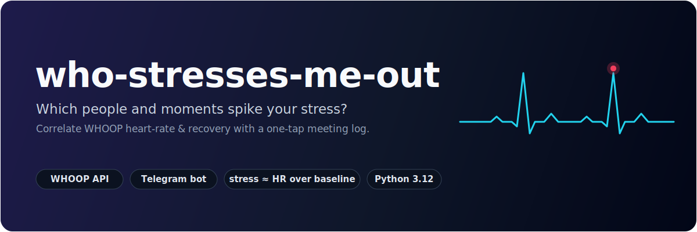
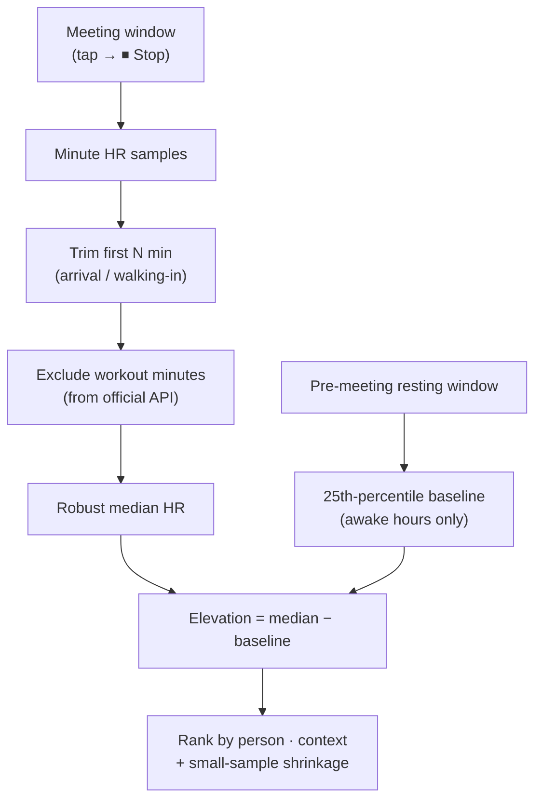
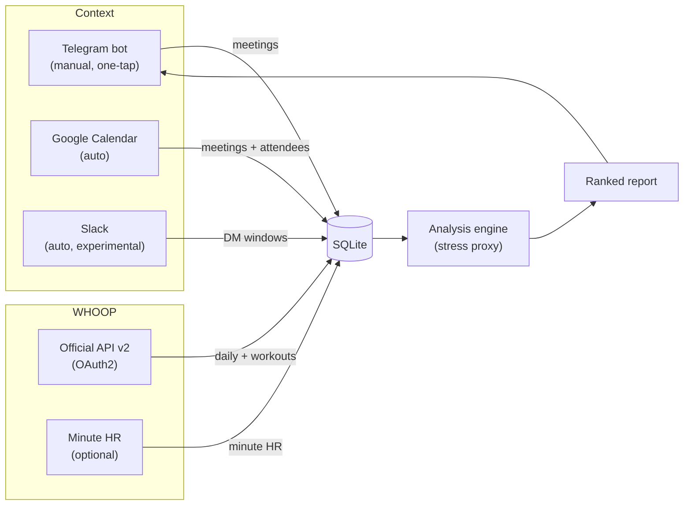

<p align="center">
  
</p>

<p align="center">
  
  
  
  
  
</p>

<p align="center">
  <b>Which people and situations actually raise your stress?</b><br>
  Log your meetings with one tap on Telegram, and this tool correlates each one with your
  <b>WHOOP</b> heart-rate & recovery data to rank <i>who</i> and <i>what</i> spikes you.
</p>

---

## 💡 The idea

WHOOP measures your body's strain and recovery all day, but it can't tell you *why* a day
went badly. This project closes that loop: you log the social context (**who** you were with,
**where**, in **what role** — e.g. `Sam · work` vs `Sam · ex`), and the analysis engine
lines those moments up against your heart rate to answer a very human question —

> *"Who stresses me out, and in which situations?"*

It runs as a small always-on **Telegram bot** for logging, plus a **WHOOP** data pipeline and
an analysis engine that turns raw beats-per-minute into a ranked, human-readable report.

```text
📊 Stress Report (last 7 days)

👤 By person · context (median HR elevation):
  • Sam · ex:     +18.4 bpm (adj +12.1) · peak +31 · 4×
  • Alex · work:   +11.2 bpm (adj +7.8)  · peak +19 · 3×
  • Jordan · daily:  +3.1 bpm (adj +2.0)  · peak +9  · 5×

🌙 Day-level (official WHOOP, 9 days):
  Personal avg recovery 64% · HRV 88ms · RHR 60
  • Sam · ex: recovery −12 pts (52%), HRV −9ms, RHR +3 · 4 days

🧭 Feeling ↔ measurement agreement: 6/7 (86%)
```

## ✨ Features

- **Automatic context** *(optional)* — skip logging entirely: pull **who you were with**
  straight from your **Google Calendar** (real meeting windows + attendees) and **Slack**, and
  the analysis runs hands-free. See [Automatic context](#-automatic-context-no-manual-logging).
- **One-tap logging** — or log manually: a persistent Telegram keyboard of `person · context`
  shortcuts. Tap to start a meeting, tap **⏹ Stop** to end it. No typing required.
- **Two data sources, graceful fallback**
  - *Official WHOOP API v2* (OAuth2) → daily recovery, HRV, resting HR, strain, sleep + workouts.
  - *Minute-level heart rate* → intra-meeting "spike" resolution (see [caveats](#-data-sources)).
- **A real stress proxy, not just raw BPM** — pre-meeting resting baseline, arrival-trim,
  workout exclusion, robust median, and small-sample shrinkage (see [methodology](#-how-the-stress-signal-works)).
- **Two analysis modes** — minute-level (per-meeting spike) *and* day-level (next-morning
  recovery deficit), so you get a signal even with daily-only data.
- **Context dimension** — the same person in different roles (`work` / `ex` / `daily`) is ranked
  separately, because context matters more than the person alone.
- **Subjective vs measured** — optionally rate how tense you *felt* (1–5); the report shows how
  well your feeling matched your physiology.
- **Runs 24/7** — ships with a PM2 ecosystem (bot + daily sync + weekly report) and a test suite.

## 🧠 How the stress signal works

The official WHOOP API does **not** expose the in-app *Stress Monitor* score, so "stress" here is
a **heart-rate proxy**: how far above your personal resting baseline your heart rate sits during a
meeting, when you're not physically active.



Key design choices that keep the ranking honest:

| Problem | Naïve approach | What this does |
| --- | --- | --- |
| Sleep drags the baseline down | whole-day percentile | **pre-meeting, awake-only** baseline |
| Walking in inflates the window | mean over full window | **trim** first minutes + **median** |
| A gym session looks like stress | nothing | **exclude workout minutes** (official API) |
| One noisy meeting outranks a stable one | raw average | **shrink** toward the mean by sample size |
| "Person" hides the real driver | group by name | group by **person · context** |

Day-level mode uses a different, complementary signal: stress shows up overnight, so it compares
your **next-morning recovery / HRV / resting-HR** on days you saw someone against your personal
average.

## 🏗 Architecture



| Module | Role |
| --- | --- |
| `bot.py` | Telegram logger: shortcut keyboard, `/meet` wizard, data-hygiene commands |
| `sources/` | Automatic context: `google_calendar`, `slack` → shared `Meeting` shape |
| `auto_sync.py` | Pulls enabled sources into the events table (de-duplicated) |
| `whoop_oauth.py` | Official WHOOP API v2 client (OAuth2, token rotation, daily sync) |
| `whoop_source.py` | Minute-level heart-rate fetch (chunked) |
| `analyze.py` | Stress-proxy engine (minute-level + day-level) |
| `report.py` | Renders the HTML report and sends it to Telegram |
| `db.py` | SQLite layer (events, HR cache, daily context, shortcuts) |
| `sync.py` | Scheduled sync of all sources |

## 🗓 Automatic context (no manual logging)

Don't want to log anything? Point the tool at your work life and it fills in the *who* for you:

```env
AUTO_SOURCES=google_calendar,slack
```

- **Google Calendar** *(strong signal)* — every timed event becomes a meeting: the window is
  the event's start/end, the person is the other attendee(s), the title is the topic. All-day
  events, solo blocks, and events you declined are skipped.
- **Slack** *(experimental, weak signal)* — clusters direct-message activity into "conversation
  windows". Text chat is a poor proxy for a stress window, so treat it as a hint only.

Everything lands in the same `events` table as manual logs, de-duplicated by `(source, ext_id)`,
so the stress engine treats calendar meetings, Slack windows, and taps identically. Setup:
[docs/AUTO_SOURCES_SETUP.md](docs/AUTO_SOURCES_SETUP.md). Adding your own source is one small
module in `sources/`.

## 🔌 Data sources

| Source | Gives you | Status |
| --- | --- | --- |
| **Official WHOOP API v2** (OAuth2) | recovery, HRV, resting HR, day strain, sleep, workouts | ✅ Supported, sanctioned |
| **Minute-level heart rate** | intra-meeting HR for spike analysis | ⚠️ Uses WHOOP's **undocumented** internal API |

> **On minute-level HR:** WHOOP does not offer continuous heart rate through its official API or
> data export. The optional minute-level path talks to WHOOP's internal endpoints, which is a gray
> area under WHOOP's Terms and can break at any time. It only ever reads **your own** data. If you
> only use the official API, you still get the full **day-level** analysis. Use the minute-level
> path at your own discretion.

## 🚀 Quick start

```bash
git clone https://github.com/archixusa/who-stresses-me-out.git
cd who-stresses-me-out
pip install -r requirements.txt
cp .env.example .env      # then fill it in
```

Fill `.env`:

- `TELEGRAM_BOT_TOKEN` — create a bot with [@BotFather](https://t.me/BotFather)
- `TELEGRAM_CHAT_ID` — your own chat id (only this id may log)
- *(optional)* WHOOP OAuth — see [docs/WHOOP_OAUTH_SETUP.md](docs/WHOOP_OAUTH_SETUP.md)

Run:

```bash
python bot.py            # the logger (long-running)
python sync.py           # pull WHOOP data
python report.py 7       # print + send the last-7-days report
python _smoketest.py     # end-to-end test on synthetic data
```

### 24/7 with PM2

```bash
pm2 start ecosystem.config.js && pm2 save
```

Runs the bot continuously, syncs daily at 05:30, and sends a weekly report Monday 09:00.

## 🤖 Bot commands

| Command | What it does |
| --- | --- |
| *(shortcut buttons)* | tap `person · context` to start a meeting; **⏹ Stop** to end it |
| `/meet` | step-by-step logging (adds mood & topic) |
| `/log Person \| Place \| Topic` | quick one-line log |
| `/kisayollar` `/ekle` `/cikar` | manage shortcut buttons |
| `/son` `/sil <id>` | list / delete recent entries |
| `/gun` | today's WHOOP context (recovery / strain / sleep) |
| `/rapor` | the stress analysis on demand |

## 🗂 Project structure

```
who-stresses-me-out/
├── bot.py               # Telegram logger + shortcut keyboard
├── sources/             # Automatic context (google_calendar, slack)
├── auto_sync.py         # Pull auto-sources into the events table
├── whoop_oauth.py       # Official WHOOP API v2 (OAuth2)
├── whoop_source.py      # Minute-level HR (optional)
├── whoop_token_hr.py    # Token-based HR backfill (optional)
├── analyze.py           # Stress-proxy engine
├── report.py            # Report rendering + delivery
├── sync.py              # Scheduled multi-source sync
├── db.py                # SQLite layer
├── tzutil.py            # Local-time helpers
├── config.py            # Env config + validation
├── _smoketest.py        # End-to-end test (no live accounts needed)
├── ecosystem.config.js  # PM2 process definitions
└── docs/
    └── WHOOP_OAUTH_SETUP.md
```

## ⚠️ Disclaimers

- **Not affiliated with, endorsed by, or connected to WHOOP.** WHOOP is a trademark of WHOOP, Inc.
- **Not medical advice.** The "stress" score is a heart-rate-derived proxy, not a clinical measure;
  many things (caffeine, walking, excitement) raise heart rate. Treat it as a hint, not a verdict.
- **Your data only.** The tool reads your own account and stores everything locally in SQLite.
- The minute-level path uses undocumented WHOOP endpoints — see [Data sources](#-data-sources).

## 📄 License

[MIT](LICENSE) © 2026 Furkan Şahin
